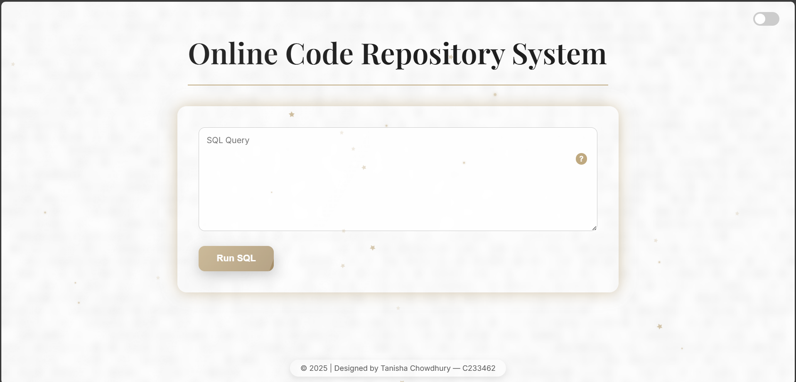
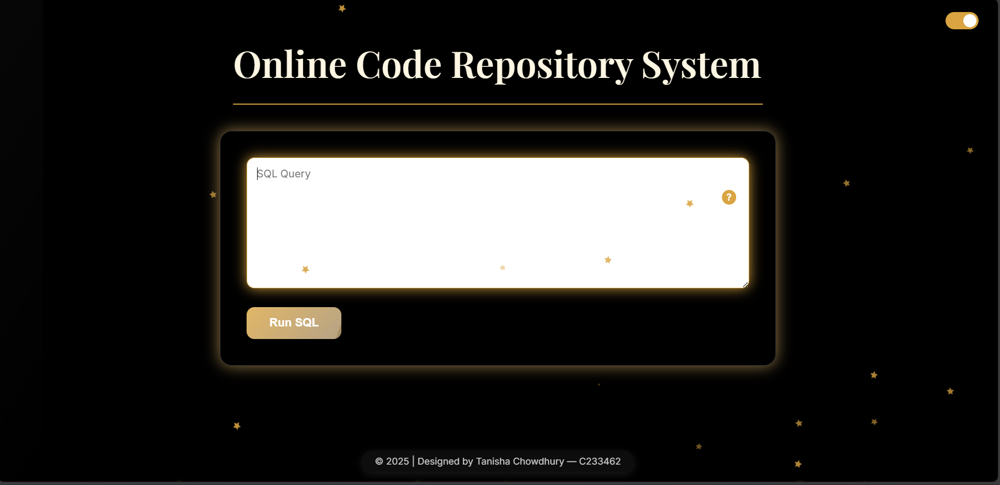
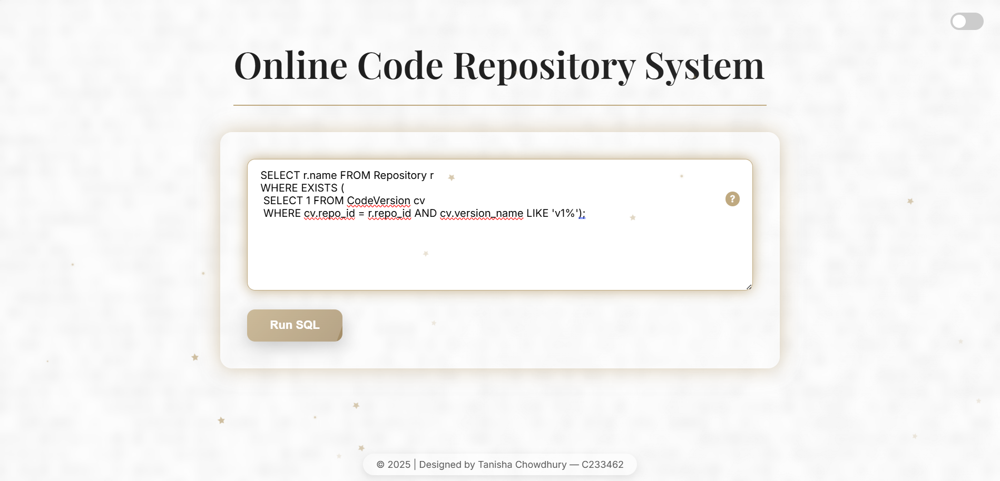
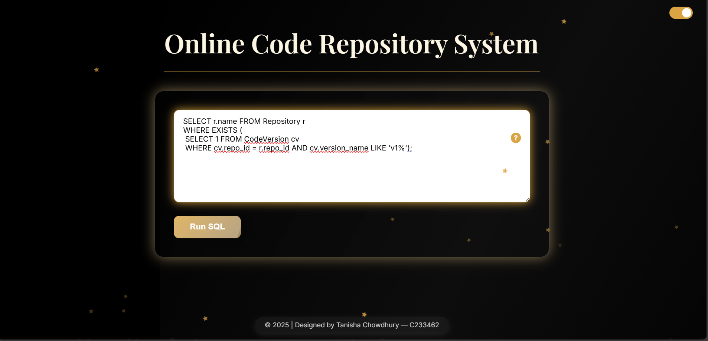
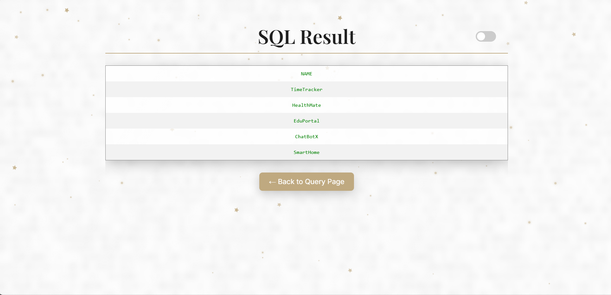
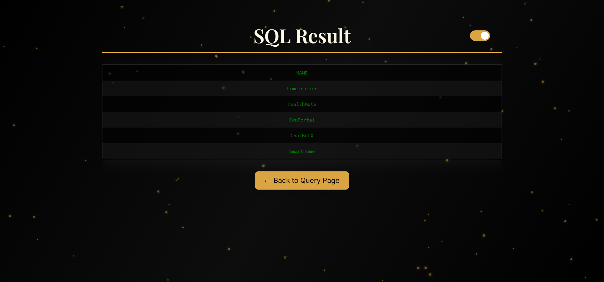

# Online Code Repository System  

An interactive **web-based SQL execution and code repository system** built using **PHP** and **Oracle SQL\***.  
This project allows users to submit SQL queries through a modern UI, execute them on the backend, and view results in a clean, styled table format.  

---

## ✨ Features  

- 🎨 Modern UI with animations, typewriter effect, and light/dark theme toggle  
- 🖊️ SQL Query Editor – run Oracle SQL queries directly from the browser  
- 📊 Formatted Results – query results are displayed in dynamic HTML tables  
- 🗄️ Database Schema for managing:  
  - Users  
  - Repositories  
  - Code Versions  
  - Collaborators  
  - Download History  
- 📥 Execution Backend – queries are executed via SQL\*Plus and results parsed into styled HTML  
- 🌙 Dark/Light Theme Switcher with local storage persistence  

---

## 📂 Project Structure  
```
Online-Code-Repository-System/
├─ src/
│ ├─ index.php   # Main query input page
│ ├─ run.php     # Executes SQL query using SQL*Plus
│ ├─ result.php  # Displays results (table or message)
│
├─ db/
│ └─ schema.sql # Oracle SQL schema (Users, Repository, etc.)
│
├─ assets/
│ └─ images/ # (UI screenshots, logos, etc.)
│
└─ README.md # Project documentation
```

## 🛠️ Tech Stack  

- **Frontend**: HTML5, CSS3 (embedded in PHP), JavaScript  
- **Backend**: PHP 8+  
- **Database**: Oracle 10g / 11g XE (via SQL\*Plus)  
- **Execution**: Queries sent to `sqlplus` through PHP’s `shell_exec`  

---

## 🚀 Getting Started  

### 1. Clone the Repository  
```bash
git clone https://github.com/tanisha1402/Online-Code-Repository-System.git
cd Online-Code-Repository-System
```
### 2. Setup Database
Open Oracle SQL* and run the schema:
@db/schema.sql

### 3. Configure PHP & Oracle
Make sure PHP is installed and enabled to run shell_exec.

Install and configure Oracle XE / SQL*Plus.

Update credentials in run.php if necessary:
$command = 'sqlplus -S system/password@XE @query.sql > output.txt';

### 4. Run the Application
Place the project in your web server’s root (e.g., htdocs/ or www/)

Start Apache/Nginx and Oracle DB

Open in browser:
http://localhost/Online-Code-Repository-System/src/index.php

### 📸 Screenshots








### 📄 Project Report

The full project report (PDF, ~116 MB) is available here:  
[View/Download Project Report] (https://drive.google.com/file/d/1Q_4Rtn9wsag1DQJa2WWunDe4JEDX0BFJ/view?usp=drive_link)

> ⚠️ Note: Please download the file from Google Drive. Make sure to have a PDF reader installed.

### 🔮 Future Improvements
🔐 User authentication (login & registration)

📂 Repository management (create, update, delete)

📊 Dashboard with analytics (query history, repo stats)

👩‍💻 Author : Tanisha Chowdhury

📌 GitHub Acc    : [tanisha1402](https://github.com/tanisha1402)

📌 Contact info  : tanishachowdhury1402@gmail.com

⚡ This project was created as part of an academic assignment and demonstrates SQL query execution with a repository-like database structure.
